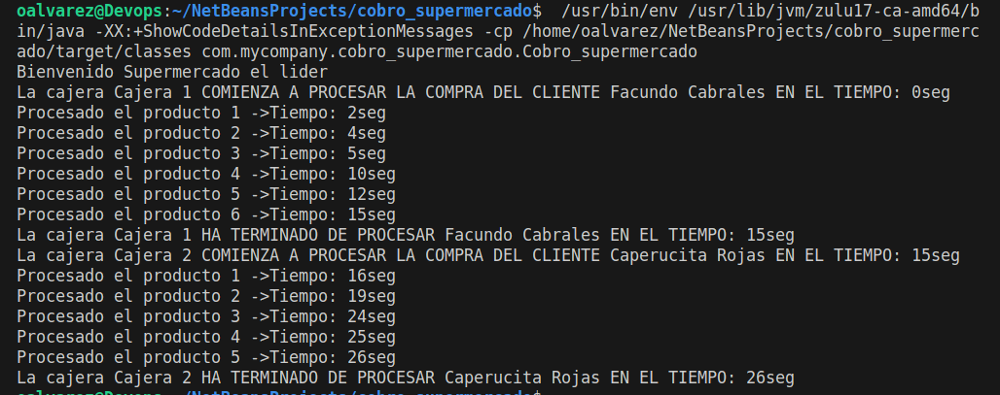

# Caso de Estudio - Simulación de Cobro en un Supermercado.
## Introducción
El Departamento de Tecnología en Desarrollo de Software de la IUDigital de Antioquia ha sido contactado por un supermercado local para implementar una solución que simule el proceso de cobro en las cajas registradoras. El objetivo es utilizar la concurrencia y los hilos
para agilizar el proceso de cobro y brindar a los estudiantes una oportunidad de aplicar sus conocimientos en un caso real.
Este proyecto se trata de una simulación de cobro en un supermercado, donde el usuario puede elegir, las cajeras, clientes y productos.

### Clase Main
La clase `Main` es la principal del proyecto, donde se encuentran las funciones que permiten realizar el cobro y mostrar el tiempo que se gasta la cajera en realizar un proceso tras otro.

`    public static void main(String[] args) {
        System.out.println("Bienvenido Supermercado el lider");
        Cliente cliente1 = new Cliente("Facundo Cabrales", 1, new int[]{2, 2, 1, 5, 2, 3});
        Cliente cliente2 = new Cliente("Caperucita Rojas", 2, new int[]{1, 3, 5, 1, 1});
        Cajera cajera1 = new Cajera("Cajera 1", 1, 1);
        Cajera cajera2 = new Cajera("Cajera 2", 2, 2);
        long timeStamp = System.currentTimeMillis();
        cajera1.procesarCompra(cliente1, timeStamp);
        cajera2.procesarCompra(cliente2, timeStamp);
        //System.out.println(cajera1.getTotal());
    } `

# Resultado final imagen

